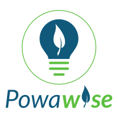

    

# Powa*wise*
A loadshedding schedule tool for South Africa.

# Quick start guide *

    1. Open your favourite browser.
    2. Type the url in the address bar and click enter.
    3. Search your loadshedding region by name.
    4. Once the search results have finished loading.
    5. Click on your region to see the current loadshedding schedule for today. 

### * **NOTE**: Site is curently under development.

### Created By <a href="https://www.linkedin.com/in/avuyile-mgxotshwa-3414a4158" >Avuyile Mgxotshwa</a>
